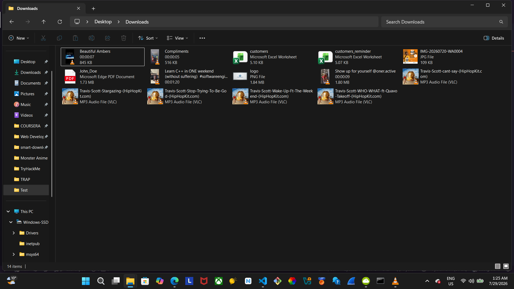
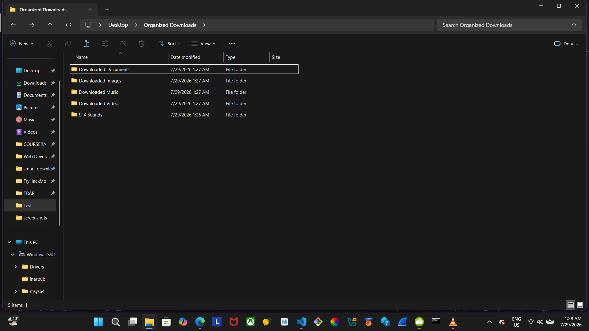
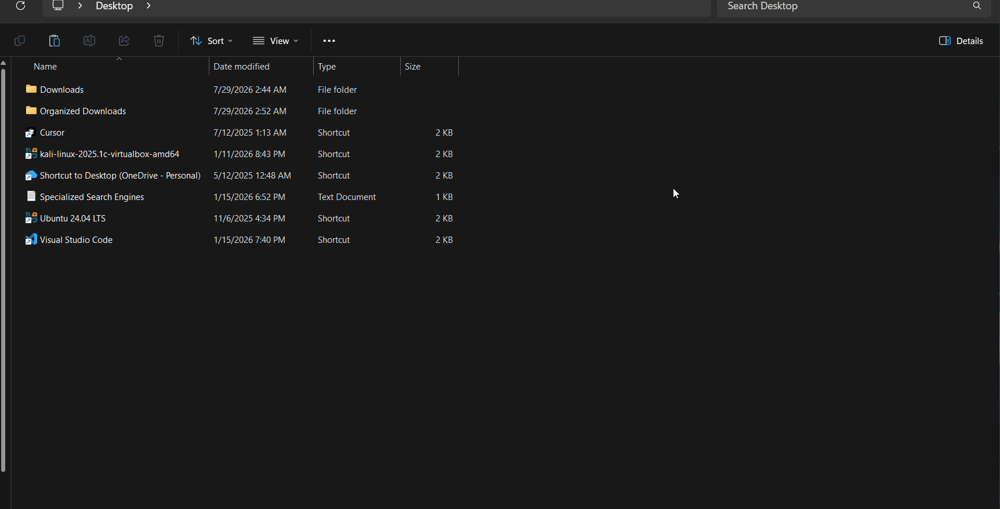

````markdown
# Automated File Organizer

A Python automation tool that continuously monitors a folder and automatically organizes files into categorized directories.

Instead of manually sorting downloaded files, this program detects newly added files and moves them into the appropriate folder based on their file type.

---

## Features

- Automatically monitors a directory in real time.
- Organizes images into a dedicated folder.
- Organizes videos into a dedicated folder.
- Separates audio files from sound effects based on file size and filename.
- Organizes documents into a dedicated folder.
- Automatically creates destination folders if they don't already exist.
- Prevents filename collisions by generating unique filenames.
- Handles files currently in use without crashing.
- Ignores temporary browser download files such as:
    - '.crdownload'
    - '.part'
    - '.tmp'
- Logs every successful file movement.

---

## Technologies Used

- Python 3
- Watchdog
- shutil
- logging
- os / os.path
- mutagen

---

## Installation

Clone the repository:

```bash
git clone https://github.com/YOUR_USERNAME/File-Organizer.git
```

Navigate into the project:

```bash
cd File-Organizer
```

Install the required package:

```bash
pip install watchdog
pip install mutagen
```

---

## Configuration

Open the script and change the monitored directory:

```python
SOURCE_DIR = r"C:\Users\YourName\Downloads"
```

The organizer automatically creates the required destination folders on first run.

---

## Running the Program

```bash
python organizer.py
```

The program will continue running and monitor the configured directory until it is stopped.

---

## Example

### Before

    Downloads/

        ```
        song.mp3
        vacation.jpg
        movie.mp4
        report.pdf
        ```

### After

```
    Organized Downloads/
    │
    ├── Downloaded Music/
    │   └── song.mp3
    │
    ├── Downloaded Images/
    │   └── vacation.jpg
    │
    ├── Downloaded Videos/
    │   └── movie.mp4
    │
    └── Downloaded Documents/
        └── report.pdf
    ```

---

## Screenshots

### Before organizing



### After organizing



### Live demonstration



---

## Future Improvements

- Support additional file categories.
- Read configuration from a JSON or YAML file.
- Allow custom folder mappings.
- Add a graphical user interface (GUI).
- Support multiple monitored directories.

---

## License

This project is licensed under the MIT License.
````
